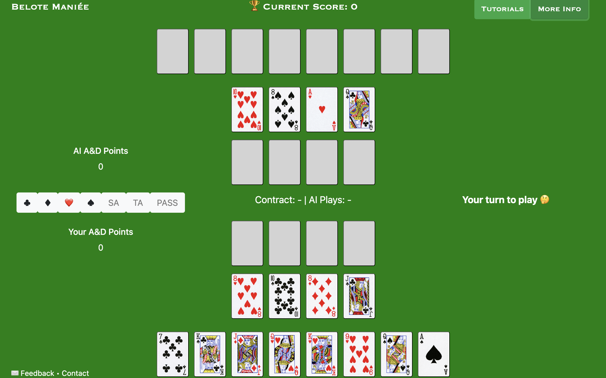

# Belote Maniée

Introducing Online Belote Maniée - the 2 handed variant to the classic game of French Belote.

[This Game Has It All](https://seanariel.com/2022/10/15/lancey-the-man-howard-the-fundamental-principle-of-strategic-game-design/): fun, strategic, smooth learning curve but complex enough to keep you entertained for the rest of your life.

Poker, Bridge, Chess players: You'll have to take your probabilistic thinking to the next level. I think this game is for you!

Head out to `https://belotemaniee.com/` to try it out !

This is what the app looks like behind the scence:
- 100+ models trained through [Reinforcement Learning](https://seanariel.com/2022/09/28/training-a-model-to-beat-me-at-my-own-game/) (1B+ Iterations)
- Front-End + Back End API, all built in Python

Do you want to learn to build and release AI systems at scale with Python, Spark, Airflow, Docker, MLFlow & Google Cloud Platform ? 

I'm a fan of strategy games, I'm fascinated by AI and I love teaching. So I put all my Machine Learning Engineering experience in this course:

Course Teaser: `https://github.com/SeanAriel/belote-mlops-course-teaser`

Free Lectures: `https://youtu.be/bwNczwP7rFk?si=52b2oCzKl6bmGZnM`

Full Course: `https://shorturl.at/bcgxY`    